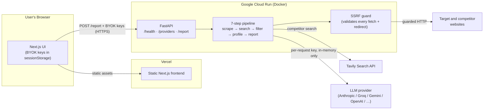

# Competitor Intelligence Engine

> Give it one company URL; get back a full competitor analysis report in ~90 seconds.

[](https://github.com/shiva-shivanibokka/Competitor-Insight-Engine/actions/workflows/ci.yml)
[](LICENSE)


**▶ Live demo: [competitor-insight-engine.vercel.app](https://competitor-insight-engine.vercel.app)** — bring your own model key (Groq/Gemini have free tiers); it never leaves your browser.

---

## Recruiter TL;DR

- **What it does:** Enter one company's URL and it autonomously scrapes the site, finds that company's real competitors via live web search, profiles each one with an LLM, and generates a structured competitive-intelligence report (overview, side-by-side matrix, strategic recommendations).
- **Hardest problem solved:** Safely fetching *arbitrary user-supplied URLs* from a public server. The scraper is a textbook SSRF vector, so every outbound request — including each redirect hop — is validated against a DNS-resolving guard that rejects private, loopback, and cloud-metadata addresses.
- **Why it's cheap to run publicly:** A **BYOK** (bring-your-own-key) design means every visitor supplies their own API keys, held only in their browser tab and sent straight to the backend — so the project costs its owner nothing to host and stores no user secrets.

---

## Overview — the problem

Competitive research is usually manual: open a dozen browser tabs, read each company's site, take notes, and hand-build a comparison table. It's slow and it goes stale the moment a new competitor appears.

This tool automates the whole loop. You give it **one URL**; it returns a structured business report in about a minute and a half — competitors discovered from a *live* web search, not a static list, so the analysis reflects the market right now.

It's built as a **portfolio piece**: a real, deployed, full-stack system rather than a notebook demo — though a notebook is included for local experimentation.

---

## Features

- **One-input analysis** — a single company URL produces a complete Markdown report.
- **Live competitor discovery** — Tavily web search finds current competitors, not a hardcoded list.
- **Two-layer competitor filtering** — an LLM ranks candidates, then a hard-coded domain blocklist rejects forums/news/review sites, so only real companies survive.
- **Bring Your Own Key (BYOK)** — pick a provider + model in the UI and paste your key; it's held in `sessionStorage` and sent browser → backend only. Never stored, logged, or seen by the hosting layer.
- **Six LLM providers, one code path** — Anthropic, Google Gemini, Groq, OpenAI, Mistral, and local Ollama, all through a single OpenAI-compatible client. Switching models changes no code.
- **SSRF-hardened scraping** — every fetch (and every redirect it would follow) is checked against a public-IP guard.
- **Concurrent competitor profiling** — competitors are scraped and profiled in a bounded thread pool to keep total runtime within the platform's request timeout.
- **Fails loudly, never silently** — validation and clear error messages at every step of the pipeline.

---

## Architecture



**Why this shape:**

- **Split frontend/backend.** The pipeline runs ~30–90s (web scraping + multiple LLM calls). That comfortably exceeds a typical static-host function budget and does poorly with datacenter-IP scraping, so the long-running Python lives on **Cloud Run** (300s request budget, real outbound networking) while **Vercel** serves a fast static UI.
- **Keys flow browser → backend directly.** The Vercel layer only serves static assets; the user's API keys are POSTed straight to the Cloud Run backend over HTTPS and used in-memory for that one request. The hosting layer never sees a secret, so there's nothing to leak.
- **Two-layer competitor filter.** LLMs occasionally return a Reddit thread or a news article as a "competitor." Relying on the prompt alone isn't enough, so a code-level blocklist runs *both* before the LLM sees search content and after it returns URLs — a site has to beat both independent layers to appear.

### BYOK — keys never leak

- Entered in the frontend, stored only in the browser tab (`sessionStorage`, key `cie_keys_v1`).
- Sent in each request body over HTTPS, straight to the backend.
- Used **in-memory for that one request** — never written to disk, env, or logs.
- Error messages name the provider, never the key. Request bodies aren't logged (uvicorn logs method/path/status only).

### Security — SSRF guard

Because the backend fetches arbitrary user-supplied URLs, it's a Server-Side Request Forgery vector. `backend/security.py` resolves each target host and refuses any that map to a private, loopback, link-local, reserved, or cloud-metadata address (e.g. `169.254.169.254`). Crucially, the guard re-runs on **every redirect hop** — a page that 302-redirects toward an internal address is not followed. The domain blocklist matches on the parsed host with a boundary check (so `x.com` in the blocklist can't accidentally match `netflix.com`).

---

## How it works

The pipeline runs seven steps (`backend/report.py`):

| Step | What happens | Model / service |
|------|--------------|-----------------|
| 1 | **Validate + scrape the main company** — check reachability, then fetch homepage + `/about`, `/product`, `/pricing` and extract clean text with BeautifulSoup | `requests` + `BeautifulSoup` |
| 2 | **Extract a company profile** — structured signals: what they do, who they serve, pricing, positioning | Fast model (LLM) |
| 3 | **Find competitors in real time** — live web search on name + industry, returns page *content* (not URLs) | Tavily |
| 4 | **Filter, validate, rank competitors** — LLM picks real companies; code-level blocklist + domain dedup enforce it | Fast model + blocklist |
| 5 | **Validate + scrape each competitor** — concurrently, skipping any that are unreachable | `requests` + thread pool |
| 6 | **Profile each competitor** — same extraction format as step 2, for an apples-to-apples matrix | Fast model (per competitor) |
| 7 | **Generate the report** — synthesize all profiles into the final Markdown report | Smart model |

Steps 5–6 run competitors **concurrently** (`ThreadPoolExecutor`, bounded), because at up to 20 competitors a sequential loop of scrapes + LLM calls would exceed the request timeout.

### The report

A clean Markdown report with five sections: **Company Overview**, **Competitor Profiles**, **Competitive Matrix** (side-by-side table), **Market Standing**, and **Strategic Recommendations** (5–7 specific actions).

---

## Tech stack

| Layer | Choice | Version | Why |
|-------|--------|---------|-----|
| Backend API | **FastAPI** + Uvicorn | 0.111 / 0.30 | Async-ready, typed request models via Pydantic, auto OpenAPI docs |
| Validation | **Pydantic** | 2.7 | Declarative request validation at the trust boundary |
| Scraping | **requests** + **BeautifulSoup4** | 2.32 / 4.13 | Simple, dependable HTML fetch + parse |
| Search | **tavily-python** | 0.7 | Live web search built for LLM pipelines |
| LLM client | **openai** SDK | 2.31 | Used as a *universal* client — every provider exposes an OpenAI-compatible API |
| Frontend | **Next.js** (App Router) + React + TypeScript | 14.2 / 18.3 / 5.5 | Fast static hosting, `next/font`, first-class Vercel deploy |
| Report rendering | **react-markdown** + **remark-gfm** | 9.0 / 4.0 | Renders the GFM tables in the report |
| Backend host | **Google Cloud Run** (Docker) | — | 300s request budget + real outbound networking for scraping |
| Frontend host | **Vercel** | — | Static Next.js hosting with git auto-deploy |
| CI | **GitHub Actions** | — | Lint (ruff) + tests on the backend, build on the frontend |

---

## Skills demonstrated

- **RESTful API design** — a FastAPI service with typed request/response models (`/health`, `/providers`, `/report`).
- **LLM application development** — a multi-step, multi-model pipeline that chains outputs (one call's result feeds the next), with structured-output prompting and a tool call (web search).
- **Application security** — SSRF prevention with redirect-hop revalidation, input validation at the boundary, and a secretless BYOK design.
- **Cloud deployment (GCP + Vercel)** — a containerized backend on Google Cloud Run and a static frontend on Vercel, deployed independently.
- **Containerization & Docker** — the backend ships as a Docker image built and run on Cloud Run.
- **CI/CD** — GitHub Actions runs linting and the test suite on every push.
- **Concurrent systems design** — bounded-thread-pool fan-out for competitor processing to stay within the request timeout.
- **Provider-agnostic integration** — one OpenAI-compatible client routing to six LLM providers with zero per-provider code.
- **Test-driven development** — 12 offline unit tests covering the security guard, blocklist, and parsing edge cases; the most recent fixes were written test-first.
- **System design & tradeoff reasoning** — documented why the frontend/backend are split and why competitor filtering is two-layered.

---

## Use any AI model

All LLM calls go through the **OpenAI Python SDK** as a universal client: every supported provider exposes an OpenAI-compatible REST API, so the same `client.chat.completions.create()` call works everywhere — only `base_url` and `api_key` change. No provider-specific SDK, no code changes to switch.

In the deployed app you pick the provider + model in the UI. For local/notebook runs, change the model name in `backend/config.py` (`FAST_MODEL` / `SMART_MODEL`).

| Provider | Example models | Cost |
|----------|---------------|------|
| **Anthropic** (default) | `claude-haiku-4-5`, `claude-sonnet-4-5`, `claude-opus-4-5` | Paid |
| Groq | `llama-3.3-70b-versatile`, `llama-3.1-8b-instant`, `gemma2-9b-it` | Free |
| Google Gemini | `gemini-2.0-flash`, `gemini-1.5-pro` | Free |
| OpenAI | `gpt-4o`, `gpt-4o-mini` | Paid |
| Mistral | `mistral-large-latest`, `open-mistral-7b` | Free tier |
| Ollama (local) | `llama3.2`, `phi3`, `gemma3`, `deepseek-r1` | Free (runs on your machine) |

> The deployed frontend surfaces Anthropic, Gemini, Groq, and OpenAI. Mistral and Ollama are available for local runs via `config.py`.

---

## Getting started

### Try the hosted app

Open **[competitor-insight-engine.vercel.app](https://competitor-insight-engine.vercel.app)**, pick a provider + model, paste your key(s), and generate a report. The fastest free path: a free **Groq** key (`llama-3.3-70b-versatile`) + a free **Tavily** key. Keys stay in your browser.

### Run it locally

**Backend (API):**
```bash
cd backend
pip install -r requirements.txt
uvicorn app:app --reload --port 7860      # http://localhost:7860/docs
```

**Frontend (UI):**
```bash
cd frontend
npm install
echo "NEXT_PUBLIC_BACKEND_URL=http://localhost:7860" > .env.local
npm run dev                                # http://localhost:3000
```

Then open the UI, pick a provider + model, paste your keys, and generate a report.

**Or run the pipeline in the notebook** (uses a local `.env` for keys instead of BYOK):
```bash
cp .env.example .env      # then fill in ANTHROPIC_API_KEY + TAVILY_API_KEY
jupyter notebook competitor_intel.ipynb
```

Get keys: [Tavily (free)](https://app.tavily.com) · [Groq (free)](https://console.groq.com) · [Gemini (free)](https://aistudio.google.com/apikey) · [Anthropic](https://console.anthropic.com) · [OpenAI](https://platform.openai.com/api-keys)

---

## Testing

Offline unit tests — no API keys and no network needed (LLM/Tavily calls are monkeypatched):

```bash
cd backend
python -m pytest tests/ -q        # 12 tests
ruff check .                      # lint (same as CI)
python security.py                # SSRF-guard self-check
```

The suite covers the SSRF guard (including the redirect-bypass case), the domain blocklist (including substring false-positives), competitor dedup/filtering, malformed-LLM-output handling, and the URL/field parsing helpers. GitHub Actions runs the same lint + tests on every push, plus a frontend build.

---

## Deployment

**Backend → Google Cloud Run (Docker):**
```bash
cd backend
gcloud run deploy competitor-intelligence-engine \
  --source . --region us-central1 --allow-unauthenticated
```
The `Dockerfile` binds Uvicorn to Cloud Run's injected `$PORT`. It's BYOK, so there are no secrets to configure. Optionally set `ALLOWED_ORIGINS` (comma-separated) to lock CORS to your frontend origin.

**Frontend → Vercel:**
1. Import the repo and set the **Root Directory** to `frontend` (the app is in a subdirectory).
2. Add env var `NEXT_PUBLIC_BACKEND_URL` = your Cloud Run URL.
3. Deploy — Vercel auto-detects Next.js and auto-deploys on every push to `main`.

---

## Project structure

```
Competitor-Insight-Engine/
├── backend/                    # FastAPI service → Google Cloud Run (Docker)
│   ├── app.py                  # API: /health, /providers, /report (Pydantic-validated)
│   ├── report.py               # Orchestrates the 7-step pipeline; concurrent competitor profiling
│   ├── analyzer.py             # LLM calls — extraction + report generation; provider routing
│   ├── searcher.py             # Tavily search — finds competitors in real time
│   ├── scraper.py              # Web scraper — fetch (SSRF-guarded) + clean text
│   ├── security.py             # SSRF guard: validates every fetch and redirect hop
│   ├── blocklist.py            # Single source of truth for non-competitor domains
│   ├── config.py               # Providers, models, tiers, default models
│   ├── requirements.txt        # Pinned Python dependencies
│   ├── Dockerfile              # Cloud Run container (binds to $PORT)
│   ├── README.md               # Backend/API notes
│   └── tests/test_backend.py   # 12 offline unit tests (no keys / network)
├── frontend/                   # Next.js BYOK UI → Vercel
│   ├── app/page.tsx            # The app: form, provider/model dropdowns, report view
│   ├── app/layout.tsx          # Fonts (next/font) + metadata
│   ├── app/globals.css         # Styling
│   └── package.json
├── competitor_intel.ipynb      # Optional — run the pipeline locally
├── .github/workflows/ci.yml    # CI: lint + test backend, build frontend
├── .env.example                # API-key template for local/notebook use
├── LICENSE                     # MIT
└── .gitignore
```

---

## Guardrails and edge cases

Combining web scraping, a search API, and multiple LLM calls means a lot can go wrong. The pipeline validates at every step and fails with a clear message rather than crashing silently.

**Input:** empty/invalid `company_url` or `company_name` → immediate error with an example; missing URL scheme → `https://` prepended automatically; `max_competitors < 1` → rejected.

**Scraping:** unreachable main URL → stops with a checklist; page with little/no text → warns (or stops if truly empty) and suggests a specific sub-page; a competitor that 404s, redirects to a login, or times out → skipped, pipeline continues.

**Search + LLM:** Tavily failure or empty results → clear error naming the likely cause; blocklisted sites (Reddit, Forbes, G2, …) → stripped before *and* after the LLM; duplicate competitors → deduped by domain; malformed or non-object LLM output → caught and skipped, returns an empty list instead of crashing; missing/invalid provider key → error naming the exact provider.

**Report:** all competitor scrapes fail → error suggesting a retry; fewer competitors than requested → report still generated with what was found; empty report response → error suggesting a different model.

### Why two layers of competitor filtering?

An LLM alone can still return a Reddit thread or a news article as a "competitor." So the blocklist runs twice, independently: **before** the LLM (blocklisted domains stripped from search content) and **after** (every returned URL re-checked in code). A site has to beat both layers to appear — which it can't.

---

## Roadmap / known limitations

- **JavaScript-heavy sites** scrape poorly (static HTML fetch only) — the report warns when a page yields little text. A headless-browser fallback is a natural next step.
- **No persistence or caching** — every run is fresh; repeat lookups re-scrape and re-search. A cache layer would cut latency and API spend.
- **Best-effort scraping** — some sites bot-wall the scraper; those competitors are skipped rather than worked around.
- **Logging is `print`-based**, not structured — fine for Cloud Run stdout, but structured logging + metrics would be the production upgrade.
- **Single region** (Cloud Run `us-central1`); no autoscaling tuning beyond defaults.

---

## License

Released under the [MIT License](LICENSE).
