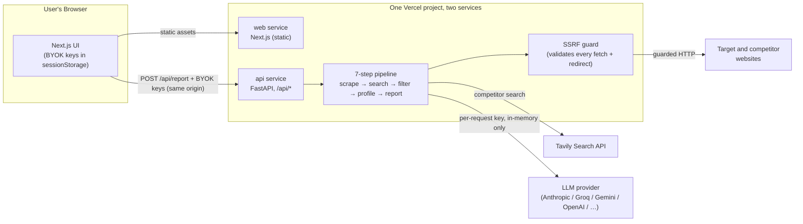

# Competitor Intelligence Engine

> Give it one company URL; get back a full competitor analysis report in ~90 seconds.

[](https://github.com/shiva-shivanibokka/Competitor-Insight-Engine/actions/workflows/ci.yml)
[](LICENSE)


**▶ Live demo: [competitor-insight-engine.vercel.app](https://competitor-insight-engine.vercel.app)** — opens on recorded real runs, so **no keys are needed to watch it work**. Bring your own model key (Groq/Gemini have free tiers) to run it against a company of your choice; it never leaves your browser.

Built by Shivani Bokka.

---

## Recruiter TL;DR

- **What it does:** Enter one company's URL and it autonomously scrapes the site, finds that company's real competitors via live web search, profiles each one with an LLM, and generates a structured competitive-intelligence report (overview, side-by-side matrix, strategic recommendations).
- **Hardest problem solved:** Safely fetching *arbitrary user-supplied URLs* from a public server. The scraper is a textbook SSRF vector, so every outbound request — including each redirect hop — is validated against a DNS-resolving guard that rejects private, loopback, and cloud-metadata addresses.
- **Why it's cheap to run publicly:** A **BYOK** (bring-your-own-key) design means every visitor supplies their own API keys, held only in their browser tab and sent straight to the backend — so the project costs its owner nothing to host and stores no user secrets.
- **See it work in one click:** the page opens on recorded real runs, so you can watch the pipeline execute end to end without going and fetching two API keys first.
- **The bug worth reading about:** the model dropdown was a hardcoded list, and one of its entries had been retired by the provider months earlier. It 404'd for anyone who selected it, and nothing in the codebase could notice. The fix was to stop hardcoding: the app now asks the provider which models a given key can use. See [Keeping the model list honest](#keeping-the-model-list-honest).

---

## Overview — the problem

Competitive research is usually manual: open a dozen browser tabs, read each company's site, take notes, and hand-build a comparison table. It's slow and it goes stale the moment a new competitor appears.

This tool automates the whole loop. You give it **one URL**; it returns a structured business report in about a minute and a half — competitors discovered from a *live* web search, not a static list, so the analysis reflects the market right now.

It's built as a **portfolio piece**: a real, deployed, full-stack system rather than a notebook demo — though a notebook is included for local experimentation.

---

## Features

- **One-input analysis** — a single company URL produces a complete Markdown report.
- **Live competitor discovery** — Tavily web search finds current competitors, not a hardcoded list.
- **Two-layer competitor filtering** — an LLM ranks candidates, then a hard-coded domain blocklist rejects forums/news/review sites, so only real companies survive.
- **Bring Your Own Key (BYOK)** — pick a provider + model in the UI and paste your key; it's held in `sessionStorage` and sent browser → backend only. Never stored, logged, or seen by the hosting layer.
- **Six LLM providers, one code path** — Anthropic, Google Gemini, Groq, OpenAI, Mistral, and local Ollama, all through a single OpenAI-compatible client. Switching models changes no code.
- **SSRF-hardened scraping** — every fetch (and every redirect it would follow) is checked against a public-IP guard.
- **Concurrent competitor profiling** — competitors are scraped and profiled in a bounded thread pool to keep total runtime within the platform's request timeout.
- **Watchable without keys** — the app opens on a set of recorded real runs across different industries. Pick one and watch the pipeline execute; the live form is the second tab.
- **Fails loudly, never silently** — validation and clear error messages at every step of the pipeline.

---

## Architecture



**Why this shape:**

- **One project, two services.** `vercel.json` declares a `web` service rooted at `frontend/` and an `api` service rooted at `backend/`, with `/api/*` rewritten to the second. The UI and the pipeline deploy together from one push, and the browser calls the API same-origin — no CORS, no second host to keep alive, no environment variable that can point at the wrong backend.
- **Why not a separate backend host.** It was on Google Cloud Run until September 2026, which worked, and then the account's trial was set to lapse and take the service with it. That is the failure mode worth designing against: a portfolio demo whose backend quietly expires. Vercel Hobby has no trial to end, and a `maxDuration` of 300s on the API service matches the request budget Cloud Run gave it, so nothing about the pipeline had to change.
- **Keys flow browser → API directly.** The static layer never sees a key; they're POSTed to `/api/report` and used in-memory for that one request. There is no server-side secret to leak because there is no server-side secret.
- **Two-layer competitor filter.** LLMs occasionally return a Reddit thread or a news article as a "competitor." Relying on the prompt alone isn't enough, so a code-level blocklist runs *both* before the LLM sees search content and after it returns URLs — a site has to beat both independent layers to appear.

### BYOK — keys never leak

- Entered in the frontend, stored only in the browser tab (`sessionStorage`, key `cie_keys_v1`).
- Sent in each request body over HTTPS, straight to the backend.
- Used **in-memory for that one request** — never written to disk, env, or logs.
- Error messages name the provider, never the key. Request bodies aren't logged (uvicorn logs method/path/status only).

### Security — SSRF guard

Because the backend fetches arbitrary user-supplied URLs, it's a Server-Side Request Forgery vector. `backend/security.py` resolves each target host and refuses any that map to a private, loopback, link-local, reserved, or cloud-metadata address (e.g. `169.254.169.254`). Crucially, the guard re-runs on **every redirect hop** — a page that 302-redirects toward an internal address is not followed. The domain blocklist matches on the parsed host with a boundary check (so `x.com` in the blocklist can't accidentally match `netflix.com`).

**What it does not defend against**, stated rather than implied: the guard resolves the host, then `requests` resolves it again to open the socket. A DNS entry that answers with a public address the first time and a private one the second — a rebinding attack — would slip between those two lookups. Closing it properly means pinning the resolved IP into the connection, which this does not do. It is a real limit of a check that validates a name rather than a socket.

---

## Two tabs: recorded runs, and your own

BYOK has an obvious cost. Someone who opens the link without an Anthropic key
*and* a Tavily key sees a form demanding two API keys and leaves — which for
most people who click through is the entire product.

So the app opens on **Recorded runs**, not on the form. Pick a company from the
list and watch the pipeline execute against it: the real log stream at its real
pacing, then the report that run produced. **Run it live** is the second tab,
for anyone who wants it pointed at a company of their own.

Each recording is an actual run. `backend/record_demo.py` executes the pipeline
and captures its stdout with real timestamps plus the report; the page replays
that at 6×. The recordings are of several different companies across different
industries, on purpose — one run shows the pipeline works, a set shows it isn't
tuned to a single site's HTML.

Every recording is labelled with its date, its models, how many competitors were
actually profiled, and the true duration, and it says plainly that nothing is
executing. Nothing is simulated and nothing is re-enacted. If no recordings are
committed the tab says so rather than showing a fabricated one.

Re-record them with:

```bash
cd backend && python record_demo.py --set                     # the whole set
cd backend && python record_demo.py --company X --url https://x.com   # just one
```

`index.json` — what the picker reads — is generated from whatever recordings are
on disk rather than maintained by hand, because a hand-written list of files is
the same rotting-catalogue problem as a hardcoded model list, one directory
further along. Deleting a recording is all it takes to retire it. A test checks
the index against the directory, since a stale entry is a button that 404s.

Keys are scrubbed on the way out, the recorder asserts none survived, and a test
re-checks every committed recording. Those files are the artifacts here most
able to publish a key by accident, and the ones nobody would think to re-read
before shipping.

**A caveat kept rather than hidden:** the count on each card is competitors
*profiled*, not requested. Some companies bot-wall the scraper and get skipped,
so asking for four does not always yield four — and the card says which.

---

## Keeping the model list honest

The provider/model dropdowns started as a hardcoded table in `config.py`. That table listed `claude-3-haiku-20240307` long after Anthropic retired it, so a visitor who picked it got a 404 partway through a run and no explanation. Nothing in the repo could have caught it: the name was a valid string, the tests were offline, and CI was green.

Two changes, because the obvious one alone doesn't hold:

1. **Ask the provider.** `POST /api/models` returns the models a given key can actually use, via the OpenAI-compatible `/v1/models` every provider here exposes. The UI calls it as soon as a key is pasted and replaces its dropdown with the answer, and `/api/report` checks an unrecognised model against the provider rather than refusing it from a stale local list. The built-in catalogue is now a first-paint fallback for visitors who haven't entered a key yet.

2. **Stop hardcoding model quirks too.** Updating the catalogue to current models immediately broke them for a different reason: newer Anthropic models reject `temperature` outright with a 400, and every call in this pipeline sends one. Replacing a stale list of model *names* with a hand-written list of model *behaviours* would rot exactly the same way, so `llm_call` retries without `temperature` on that specific error and remembers which models it applies to. A 400 about anything else is still raised.

The general lesson, which cost a live 404 to learn: **a hardcoded list describing someone else's service is a claim with no expiry date on it.** Either ask the service, or expect the list to be wrong eventually and silently.

---

## How it works

The pipeline runs seven steps (`backend/report.py`):

| Step | What happens | Model / service |
|------|--------------|-----------------|
| 1 | **Validate + scrape the main company** — check reachability, then fetch homepage + `/about`, `/product`, `/pricing` and extract clean text with BeautifulSoup | `requests` + `BeautifulSoup` |
| 2 | **Extract a company profile** — structured signals: what they do, who they serve, pricing, positioning | Fast model (LLM) |
| 3 | **Find competitors in real time** — live web search on name + industry, returns page *content* (not URLs) | Tavily |
| 4 | **Filter, validate, rank competitors** — LLM picks real companies; code-level blocklist + domain dedup enforce it | Fast model + blocklist |
| 5 | **Validate + scrape each competitor** — concurrently, skipping any that are unreachable | `requests` + thread pool |
| 6 | **Profile each competitor** — same extraction format as step 2, for an apples-to-apples matrix | Fast model (per competitor) |
| 7 | **Generate the report** — synthesize all profiles into the final Markdown report | Smart model |

Steps 5–6 run competitors **concurrently** (`ThreadPoolExecutor`, bounded), because at up to 20 competitors a sequential loop of scrapes + LLM calls would exceed the request timeout.

### The report

A clean Markdown report with five sections: **Company Overview**, **Competitor Profiles**, **Competitive Matrix** (side-by-side table), **Market Standing**, and **Strategic Recommendations** (5–7 specific actions).

---

## Tech stack

| Layer | Choice | Version | Why |
|-------|--------|---------|-----|
| Backend API | **FastAPI** + Uvicorn | 0.111 / 0.30 | Async-ready, typed request models via Pydantic, auto OpenAPI docs |
| Validation | **Pydantic** | 2.7 | Declarative request validation at the trust boundary |
| Scraping | **requests** + **BeautifulSoup4** | 2.32 / 4.13 | Simple, dependable HTML fetch + parse |
| Search | **tavily-python** | 0.7 | Live web search built for LLM pipelines |
| LLM client | **openai** SDK | 2.31 | Used as a *universal* client — every provider exposes an OpenAI-compatible API |
| Frontend | **Next.js** (App Router) + React + TypeScript | 14.2 / 18.3 / 5.5 | Fast static hosting, `next/font`, first-class Vercel deploy |
| Report rendering | **react-markdown** + **remark-gfm** | 9.0 / 4.0 | Renders the GFM tables in the report |
| Hosting | **Vercel** (two services, one project) | — | Static UI and a 300s Python service deploy together; no second host, nothing to expire |
| CI | **GitHub Actions** | — | Lint (ruff) + tests on the backend, build on the frontend |

---

## Skills demonstrated

- **RESTful API design** — a FastAPI service with typed request/response models (`/health`, `/providers`, `/models`, `/report`).
- **LLM application development** — a multi-step, multi-model pipeline that chains outputs (one call's result feeds the next), with structured-output prompting and a tool call (web search).
- **Application security** — SSRF prevention with redirect-hop revalidation, input validation at the boundary, and a secretless BYOK design.
- **Deployment and migration** — originally a container on Google Cloud Run plus a static Vercel frontend; migrated to a single Vercel project with two services when the Cloud Run account was set to lapse, without changing the pipeline.
- **Containerization & Docker** — the API is a plain container (`backend/Dockerfile`) and can be self-hosted as one; the current deployment builds it from source instead.
- **CI/CD** — GitHub Actions runs linting and the test suite on every push.
- **Concurrent systems design** — bounded-thread-pool fan-out for competitor processing to stay within the request timeout.
- **Provider-agnostic integration** — one OpenAI-compatible client routing to six LLM providers with zero per-provider code.
- **Test-driven development** — 22 offline unit tests covering the security guard, blocklist, parsing edge cases, the temperature-rejection retry, that every route answers under both mount points, and that the committed recording carries no key.
- **System design & tradeoff reasoning** — documented why the frontend/backend are split and why competitor filtering is two-layered.

---

## Use any AI model

All LLM calls go through the **OpenAI Python SDK** as a universal client: every supported provider exposes an OpenAI-compatible REST API, so the same `client.chat.completions.create()` call works everywhere — only `base_url` and `api_key` change. No provider-specific SDK, no code changes to switch.

In the deployed app you pick the provider + model in the UI. For local/notebook runs, change the model name in `backend/config.py` (`FAST_MODEL` / `SMART_MODEL`).

| Provider | Example models | Cost |
|----------|---------------|------|
| **Anthropic** (default) | `claude-sonnet-5`, `claude-haiku-4-5`, `claude-opus-5` | Paid |
| Groq | `llama-3.3-70b-versatile`, `llama-3.1-8b-instant`, `gemma2-9b-it` | Free |
| Google Gemini | `gemini-2.5-flash`, `gemini-2.0-flash` | Free |
| OpenAI | `gpt-4o-mini`, `gpt-4o` | Paid |
| Mistral | `mistral-large-latest`, `open-mistral-7b` | Free tier |
| Ollama (local) | `llama3.2`, `phi3`, `gemma3`, `deepseek-r1` | Free (runs on your machine) |

> The deployed frontend surfaces Anthropic, Gemini, Groq, and OpenAI. Mistral and Ollama are available for local runs via `config.py`.

---

## Getting started

### Try the hosted app

Open **[competitor-insight-engine.vercel.app](https://competitor-insight-engine.vercel.app)**. It lands on **Recorded runs** — pick a company and watch a real run, no keys needed. Switch to **Run it live** to point it at a company of your own. The fastest free path: a free **Groq** key (`llama-3.3-70b-versatile`) + a free **Tavily** key. Keys stay in your browser.

### Run it locally

**Backend (API):**
```bash
cd backend
pip install -r requirements.txt
uvicorn app:app --reload --port 7860      # http://localhost:7860/docs
```

**Frontend (UI):**
```bash
cd frontend
npm install
echo "NEXT_PUBLIC_BACKEND_URL=http://localhost:7860" > .env.local
npm run dev                                # http://localhost:3000
```

Then open the UI, pick a provider + model, paste your keys, and generate a report.

**Or run the pipeline in the notebook** (uses a local `.env` for keys instead of BYOK):
```bash
cp .env.example .env      # then fill in ANTHROPIC_API_KEY + TAVILY_API_KEY
jupyter notebook competitor_intel.ipynb
```

Get keys: [Tavily (free)](https://app.tavily.com) · [Groq (free)](https://console.groq.com) · [Gemini (free)](https://aistudio.google.com/apikey) · [Anthropic](https://console.anthropic.com) · [OpenAI](https://platform.openai.com/api-keys)

---

## Testing

Offline unit tests — no API keys and no network needed (LLM/Tavily calls are monkeypatched):

```bash
cd backend
python -m pytest tests/ -q        # 22 tests
ruff check .                      # lint (same as CI)
python security.py                # SSRF-guard self-check
```

The suite covers the SSRF guard (including the redirect-bypass case), the domain blocklist (including substring false-positives), competitor dedup/filtering, malformed-LLM-output handling, the URL/field parsing helpers, the retry that drops `temperature` for models that reject it, and that every route answers under both `/x` and `/api/x`. GitHub Actions runs the same lint + tests on every push, plus a frontend build.

**ruff is pinned** (`ruff==0.16.3` in CI, rules in `backend/ruff.toml`). Unpinned, CI installs whatever shipped most recently, so the result tracks the day it ran rather than the commit — this repo was green in July and red on the identical tree two months later.

---

## Deployment

Both halves are one Vercel project. Import the repo, leave **Root Directory** at the repo root, and deploy — `vercel.json` does the rest:

```json
"services": {
  "web": { "root": "frontend/" },
  "api": { "root": "backend/", "framework": "fastapi", "entrypoint": "app:app",
           "functions": { "app.py": { "maxDuration": 300 } } }
}
```

There are **no environment variables to set**. It's BYOK, so the deployment holds no keys, and the frontend reaches the API same-origin at `/api/*` rather than through a configured URL. `ALLOWED_ORIGINS` exists for the case where you host the API somewhere else and need to narrow CORS; same-origin doesn't need it.

Pushes to `main` redeploy both services together.

**Self-hosting the API instead.** It's an ordinary container:

```bash
cd backend && docker build -t cie-api . && docker run -p 7860:7860 cie-api
```

Then point the frontend at it with `NEXT_PUBLIC_BACKEND_URL=http://localhost:7860`.

---

## Project structure

```
Competitor-Insight-Engine/
├── backend/                    # FastAPI service → Vercel `api` service
│   ├── app.py                  # API: /health, /providers, /models, /report (Pydantic-validated)
│   ├── report.py               # Orchestrates the 7-step pipeline; concurrent competitor profiling
│   ├── analyzer.py             # LLM calls — extraction + report generation; provider routing
│   ├── searcher.py             # Tavily search — finds competitors in real time
│   ├── scraper.py              # Web scraper — fetch (SSRF-guarded) + clean text
│   ├── security.py             # SSRF guard: validates every fetch and redirect hop
│   ├── blocklist.py            # Single source of truth for non-competitor domains
│   ├── config.py               # Providers, models, tiers, default models
│   ├── requirements.txt        # Pinned Python dependencies
│   ├── Dockerfile              # for self-hosting; the deployment builds from source
│   ├── ruff.toml               # pinned lint rules (version pinned in CI)
│   ├── record_demo.py          # records the real runs behind the replay tab
│   ├── README.md               # Backend/API notes
│   └── tests/test_backend.py   # 22 offline unit tests (no keys / network)
├── frontend/                   # Next.js BYOK UI → Vercel `web` service
│   ├── app/page.tsx            # The app: form, provider/model dropdowns, report view
│   ├── app/layout.tsx          # Fonts (next/font) + metadata
│   ├── app/globals.css         # Styling
│   ├── public/demo/*.json      # the committed recordings + a generated index.json
│   └── package.json
├── vercel.json                 # the two services and the /api/* rewrite
├── competitor_intel.ipynb      # Optional — run the pipeline locally
├── .github/workflows/ci.yml    # CI: lint + test backend, build frontend
├── .env.example                # API-key template for local/notebook use
├── LICENSE                     # MIT
└── .gitignore
```

---

## Guardrails and edge cases

Combining web scraping, a search API, and multiple LLM calls means a lot can go wrong. The pipeline validates at every step and fails with a clear message rather than crashing silently.

**Input:** empty/invalid `company_url` or `company_name` → immediate error with an example; missing URL scheme → `https://` prepended automatically; `max_competitors < 1` → rejected.

**Scraping:** unreachable main URL → stops with a checklist; page with little/no text → warns (or stops if truly empty) and suggests a specific sub-page; a competitor that 404s, redirects to a login, or times out → skipped, pipeline continues.

**Search + LLM:** a rejected key or exhausted quota (Tavily or the model provider) returns 422 with the reason, not 500 — it is the caller's to fix, not a fault in the service; blocklisted sites (Reddit, Forbes, G2, …) → stripped before *and* after the LLM; duplicate competitors → deduped by domain; malformed or non-object LLM output → caught and skipped, returns an empty list instead of crashing; missing/invalid provider key → error naming the exact provider.

**Report:** all competitor scrapes fail → error suggesting a retry; fewer competitors than requested → report still generated with what was found; empty report response → error suggesting a different model.

### Why two layers of competitor filtering?

An LLM alone can still return a Reddit thread or a news article as a "competitor." So the blocklist runs twice, independently: **before** the LLM (blocklisted domains stripped from search content) and **after** (every returned URL re-checked in code). A site has to beat both layers to appear — which it can't.

---

## Roadmap / known limitations

- **JavaScript-heavy sites** scrape poorly (static HTML fetch only) — the report warns when a page yields little text. A headless-browser fallback is a natural next step.
- **No persistence or caching** — every run is fresh; repeat lookups re-scrape and re-search. A cache layer would cut latency and API spend.
- **Best-effort scraping** — some sites bot-wall the scraper; those competitors are skipped rather than worked around.
- **Logging is `print`-based**, not structured — readable in the platform's log stream, but structured logging + metrics would be the production upgrade.
- **The SSRF guard validates a hostname, not a socket**, so DNS rebinding is out of scope. See the security note above.
- **The Gemini, Groq and OpenAI catalogues in `config.py` are unverified** — there was no key on hand to check them against. They only matter before a visitor enters a key, after which the list comes from the provider.

---

## License

Released under the [MIT License](LICENSE).
